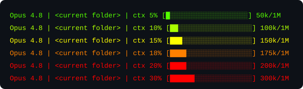

# claudecode-statusline-context



A [Claude Code mod](https://claude.com/blog/claude-code-mods) that shows
**context-window usage** at a glance — a colorized percentage, a Unicode
progress bar, and a `used / total` token count — in a band just above the
prompt.

The color runs green → yellow → red as the context fills — fully red at 200k
tokens by default, or at a point you [configure](#configuration). The bar's
empty cells preview that gradient in a darker shade, and a `│` in the current
color marks where the budget is reached (`┃` once the fill has passed it).
The line is drawn on a black background so the colors read on light themes
too. The bar and project name drop out as the terminal narrows.

## Requirements

- **Claude Code with mod support** (function-hook plugins). Tested on v2.1.287.
- A **UTF-8 terminal** (for the `█` / `░` bar glyphs) with **truecolor** support
  for the gradient (virtually all modern terminals qualify).

The band draws in the terminal and in the desktop app's Code tab.

## Installation

Install it as a plugin from this repository:

```
/plugin marketplace add petritol/claudecode-statusline-context
/plugin install context-statusline@claudecode-statusline-context
```

The band appears above the prompt and updates after each turn.

### From a local clone

```sh
git clone https://github.com/petritol/claudecode-statusline-context
claude --plugin-dir /path/to/claudecode-statusline-context
```

To load it in every session without the flag, add the folder to the `env`
block of `~/.claude/settings.json`:

```json
{
  "env": {
    "CLAUDE_CODE_PLUGIN_DIRS": "/path/to/claudecode-statusline-context"
  }
}
```

### Upgrading from the status line script

Earlier versions were a `statusLine` command script. Remove the `statusLine`
block from `~/.claude/settings.json` and delete
`~/.claude/statusline-context.js`, or the usage shows twice.

## Configuration

`contextBudget` sets the usage at which the color turns fully red; it passes
yellow at three quarters of that point. Give it a token count to keep the
gradient on fixed numbers, or a share of the context window to scale it with
whatever window the session has. The default is `200k`.

| Format       | Example          | Means                                      |
| ------------ | ---------------- | ------------------------------------------ |
| Plain number | `120000`         | 120,000 tokens                             |
| `k` suffix   | `200k`, `150.5k` | thousands of tokens                        |
| `M` suffix   | `1M`, `1.5M`     | millions of tokens                         |
| `%` suffix   | `80%`, `62.5%`   | that share of the session's context window |

- Decimals are allowed, `k` and `M` work in either case, and spaces around
  the value or before the unit are ignored.
- A percentage follows the session's window: `80%` is 160k on a 200k window
  and 800k on a 1M one. Values above `100%` are accepted, but the color then
  never reaches full red.
- Anything else falls back to `200k`: zero, negative numbers, thousands
  separators (`200,000`), scientific notation (`2e5`), a leading dot (`.5M`)
  or extra words (`200k tokens`).

Set it in `/config`, or in `~/.claude/settings.json` as a quoted string:

```json
{
  "pluginConfigs": {
    "context-statusline@claudecode-statusline-context": {
      "options": { "contextBudget": "80%" }
    }
  }
}
```

## Development

```sh
claude plugin validate .
claude plugin test .
```

## License

[The Unlicense](LICENSE) — public domain. Do whatever you want with it.
